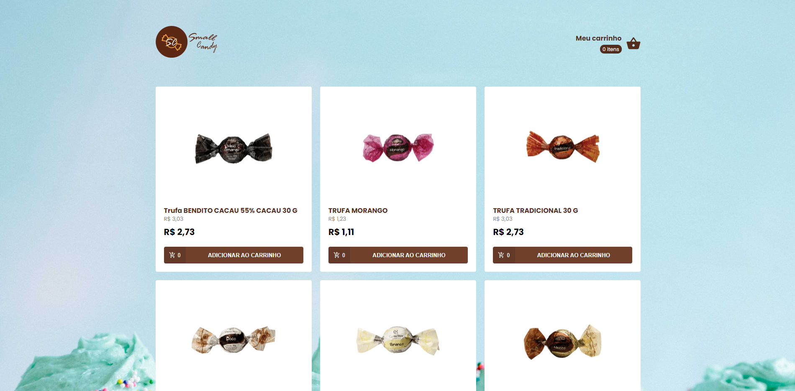
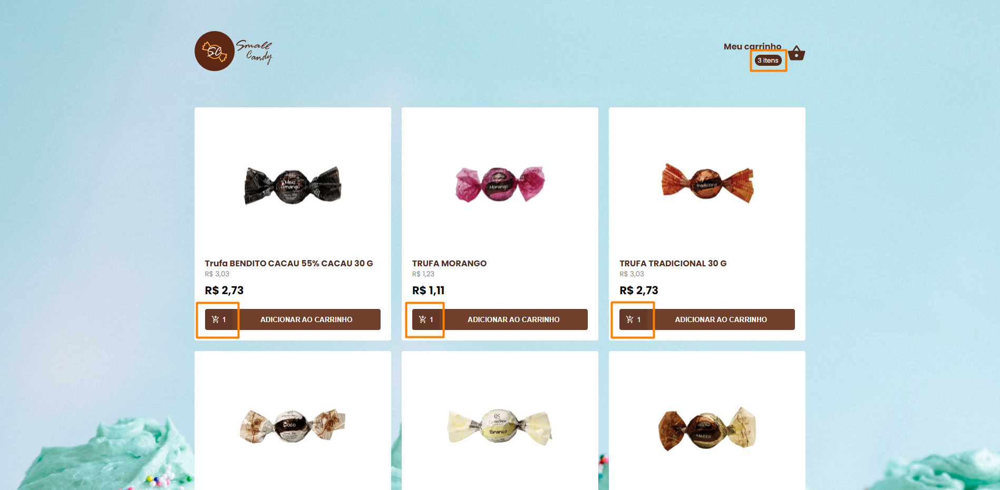
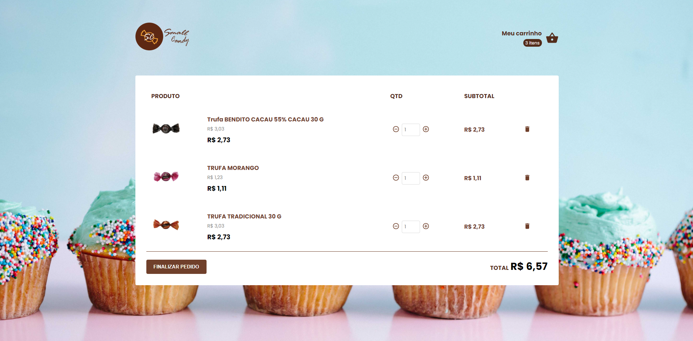
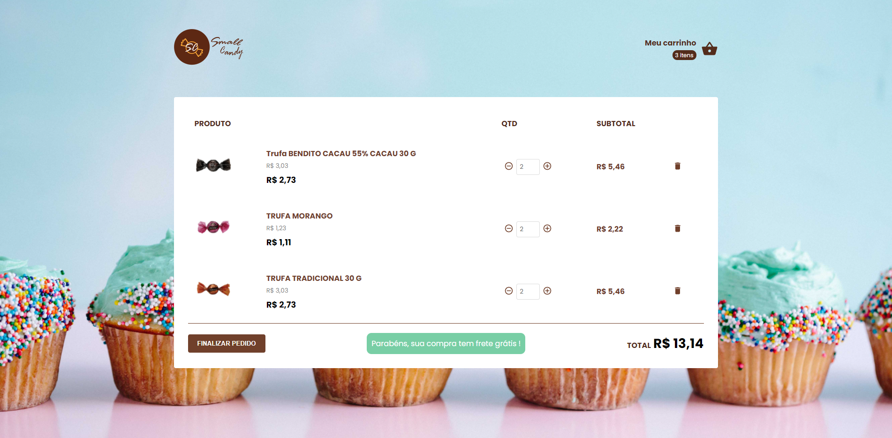

<h1 align="center">Small Candy Story 🍬 </h1>

<h4 align="center">

 

</h4>

<h3 align="center">
This application was developed with ReactJS, consuming API passed on by  <a href="https://codeby.com.br/pages/conheca-a-codeby?utm_term=codeby&utm_campaign=%5BDDWB%5D%5BRede+de+Pesquisa%5D+Institucional&utm_source=adwords&utm_medium=ppc&hsa_acc=1854130594&hsa_cam=11772819537&hsa_grp=120181058291&hsa_ad=548456206758&hsa_src=g&hsa_tgt=aud-1434713248532:kwd-370306012509&hsa_kw=codeby&hsa_mt=e&hsa_net=adwords&hsa_ver=3&gclid=Cj0KCQjw-4SLBhCVARIsACrhWLU4HQ4MQt-xhCk2U9wlkV1W0NrsHns7X6OsZVpptp98RlRXxnFb7RYaApjCEALw_wcB">Codeby</a> for the preparation of the challenge of the full frontend developer position.
</h3>

  

  

  

  

  <a href="#description">Description</a>&nbsp;&nbsp;&nbsp;|&nbsp;&nbsp;&nbsp;
  <a href="#technologies">Technologies</a>&nbsp;&nbsp;&nbsp;|&nbsp;&nbsp;&nbsp;
  <a href="#objective">Project's goal</a>&nbsp;&nbsp;&nbsp;|&nbsp;&nbsp;&nbsp;
  <a href="#result">Result</a>

 

<h2 id="description" name="description">
📝 Description
</h2>

This application is created according to the teachings of <a href="https://rocketseat.com.br/">Rocketseat</a>, focusing on the front-end, to put into practice the teachings about ReactJS and other dependencies, such as Axios for API consumption and Styled Components for style.

 

<h2 id="technologies" name="technologies">
🚀 Technologies
</h2>

- [ReactJS](https://pt-br.reactjs.org/)
- [React dom](https://pt-br.reactjs.org/docs/react-dom.html)
- [React router dom](https://reactrouter.com/web/guides/quick-start)
- [React icons](https://react-icons.github.io/react-icons/)
- [React Redux](https://react-redux.js.org/)
- [Reactotron](https://infinite.red/reactotron)
- [Styled Components](https://styled-components.com/)
- [Eslint](https://eslint.org/)
- [Prettier](https://prettier.io/)
- [Polished](https://polished.js.org/)
- [Git Commit Msg Linter](https://www.npmjs.com/package/git-commit-msg-linter)

 

<h2 id="objective" name="objective">
🎯 Project's goal
</h2>

Assembling the structure and thinking outside the box, having the challenge of providing moments to put creativity in motion, and that's what happened in this project, I raised the requirements, and thought about how it could be different, but without running away from what was asked, and so I created a flow of listing the products and adding them to the cart, controlling the quantity in the cart as well as its exclusion, and taking into account the rule that if the value is greater than R$ 10, the customer will receive free shipping.

 

<h2 id="result" name="result">
✅ Result
</h2>

#### Main screen
<h5 align="center">

#### Main screen adding products

<h5 align="center">

#### Cart page under R$10

<h5 align="center">

#### Cart page over R$10

<h5 align="center">

 

 

Made with 🧡 By Elivelton Ferreira. [Get in touch!](https://www.linkedin.com/in/eliveltonsf/) :calling:
